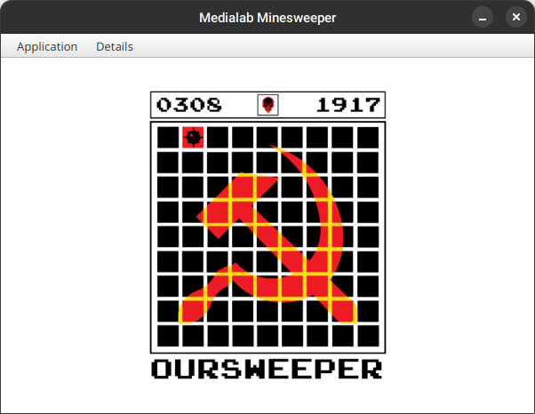
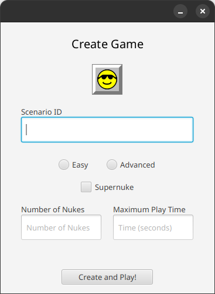
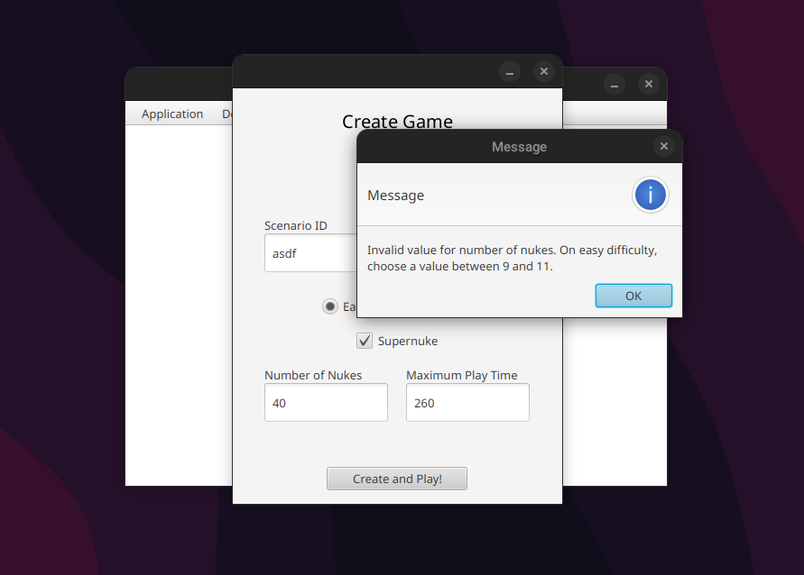
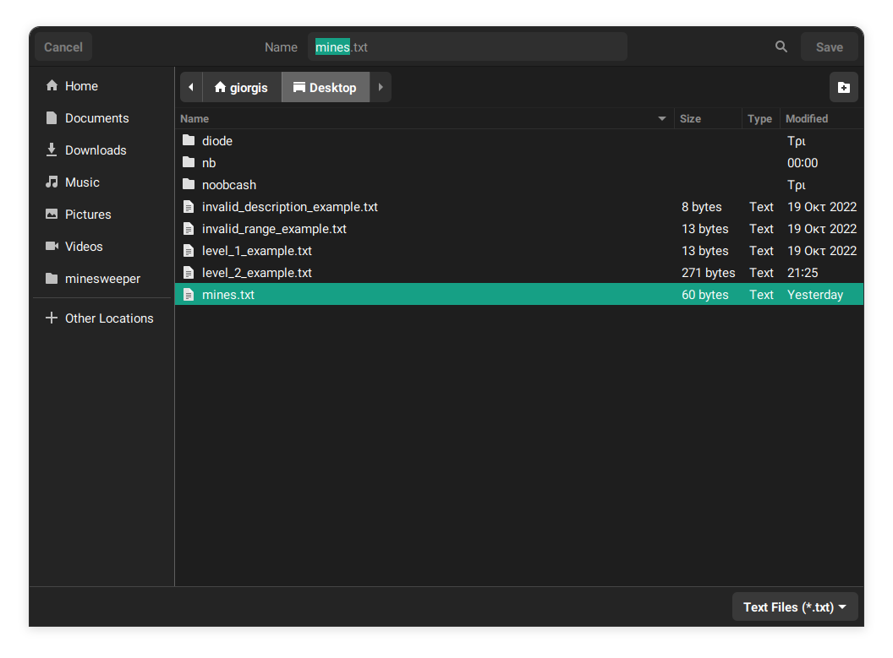
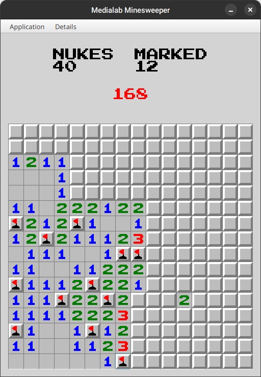
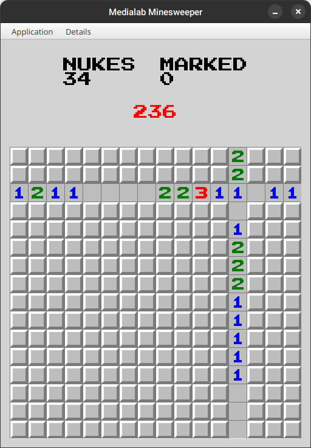
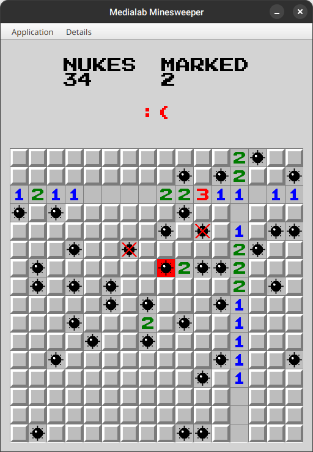
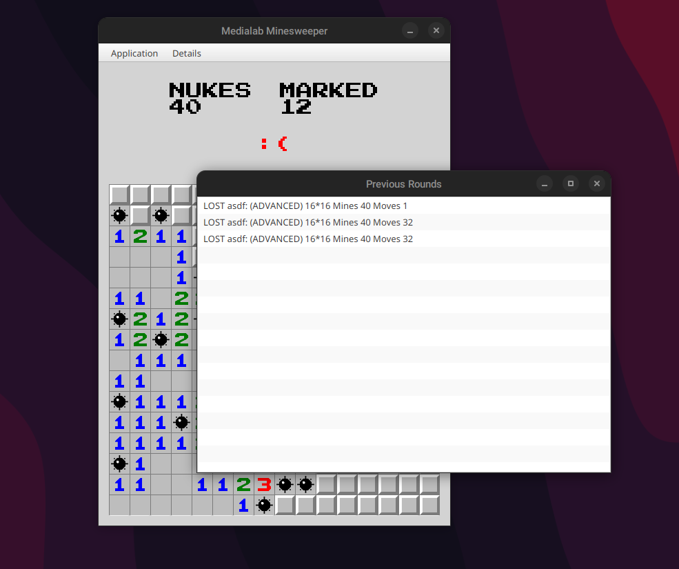
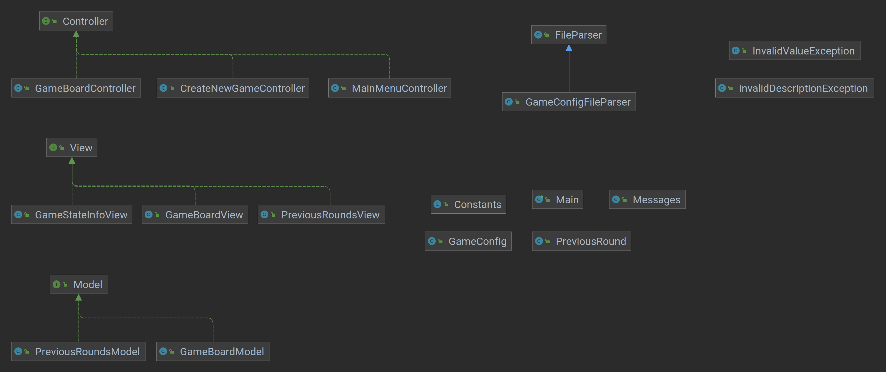

# Medialab Minesweeper

_Γεώργιος Στεφανάκης_

_Τεχνολογία Πολυμέσων, ΗΜΜΥ ΕΜΠ 2023_

## Γενικά

Μας ζητήθηκε να κατασκευάσουμε ένα παιχνίδι Ναρκαλιευτή σε Java. Χρησιμοποιήθηκε η υλοποίηση της Java OpenJDK JDK 11 ενώ για την κατασκευή της γραφικής διεπαφής, η βιβλιοθήκη JavaFX 17. To IDE που χρησιμοποιήθηκε είναι το IntelliJ IDEA. Η εφαρμογή που κατασκευάστηκε υποστηρίζει τις εξής λειτουργίες:

- Φόρτωση αρχείου κειμένου το οποίο περιλαμβάνει το σενάριο του παιχνιδιού σε μορφή όπως ζητείται στην εκφώνηση της εργασίας. Σε περίπτωση που το αρχείο δεν είναι σωστά διαμορφωμένο, ανάλογα το σφάλμα, ο χρήστης ενημερώνεται μέσω κατάλληλων μηνυμάτων.
- Κατασκευή σεναρίου και αρχικοποίηση του ταμπλό, με χρήση της παρακάτω φόρμας, χωρίς να είναι απαραίτητη η φόρτωση κάποιου αρχείου.
- Αποθήκευση σε αρχείο κειμένου των θέσεων όπου βρίσκονται νάρκες στο ταμπό που κατασκεύασε η εφαρμογή. Καθώς δεν ήταν προφανές στην εκφώνηση ποιος είναι ο προδιαγεγραμμένος φάκελος αποθήκευσης, υποστηρίζεται η αποθήκευση του αρχείου σε οποιοδήποτε μέρος του file system, με άνοιγμα σχετικού παραθύρου.
- Εκκίνηση χρονομέτρου και έναρξη παιχνιδιού.
- Εάν ο παίχτης μαρκάρει την υπερ-νάρκη στις πρώτες τέσσερις κινήσεις του, αφαιρούνται όλες οι νάρκες από όλα τα κελιά της ίδιας γραμμής και στήλης και γίνονται disabled. 
- Επίδειξη λύσης στον χρήστη. Ο γύρος θεωρείται χαμένος.
- Επίδειξη των τελευταίων γύρων που έπαιξε ο χρήστης και στοιχειών όπως εάν κέρδισε ή έχασε, αριθμό κινήσεων κ.λπ.

## Διάγραμμα Κλάσεων και Οργάνωση Κώδικα

Προσπάθησα να ακολουθήσω όσο το δυνατόν καλύτερα τις αρχές αντικειμενοστραφούς προγραμματισμού, ενώ χρησιμοποίησα αρχιτεκτονική MVC ώστε να γίνει ευκολότερη και πιο κατανοητή η ανάπτυξη του κώδικα. Έγινε διάσπαση των βασικών συνιστωσών της εφαρμογής (Model, View, Controller, Exceptions, Definitions, Utilities) στα αντίστοιχα modules του πηγαίου κώδικα. Το διάγραμμα κλασεων της εφαρμογής φαίνεται παρακάτω.

Επιπλέον, σε διάφορες κλάσεις της εφαρμογής (`GameBoardModel`, `GameConfig`, `GameConfigFileParser`) έγινε συγγραφή Javadoc τεκμηρίωσης.

Για τα στατικά views της εφαρμογής χρησιμοποίησα FXML, ενώ για τα δυναμικά views (`GameBoardView`, `GameStateInfoView`) η υλοποίηση έγινε προγραμματιστικά. Στον φάκελο `resources` υπάρχουν τα γραφικά assets της εφαρμογής όπως εικονίδια, FXML files, γραμματοσειρά.

## Παραδοχές

Καθώς δεν ήταν εμφανές ποιος είναι ο προκαθορισμένος φάκελος απ' τον οποίο θα λαμβάνουμε τα σενάρια του παιχνιδιού και θα αποθηκεύουμε τις θέσεις των ναρκών, χρησιμοποίησα modules από τη Standard Library της Java ώστε να μπορεί ο χρήστης να περιηγηθεί σε όλο το σύστημα αρχείων και να επιλέξει ο ίδιος την τοποθεσία του αρχείου. Τα exceptions που ζητήθηκε να υλοποιηθούν χρησιμοποιήθηκαν ώστε να λαμβάνει ο χρήστης JavaFX alerts σχετικά με το validation των αρχείων.

## GitHub Repository

https://github.com/stefanaki/minesweeper